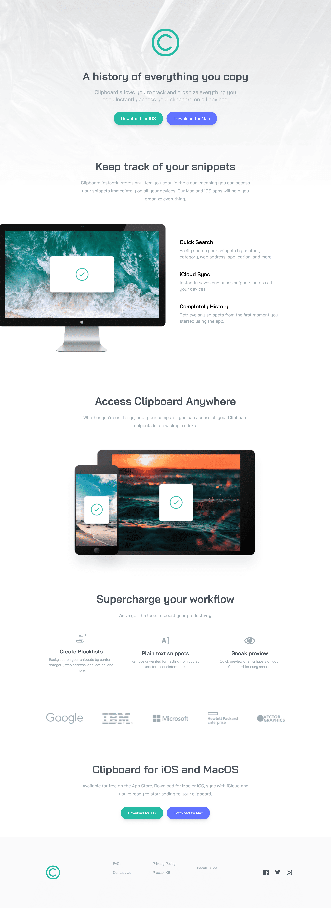

# Clipboard Website

This project is a responsive **Clipboard landing page** built using **HTML and Tailwind CSS**.  
The UI is based on the **Frontend Mentor Clipboard Landing Page challenge**, recreated to practice modern layout techniques, responsive design, and utility-first CSS using Tailwind.

The goal of this project was to strengthen my skills in:

- Tailwind CSS utility classes
- Responsive layouts (mobile-first approach)
- Clean and semantic HTML structure
- Converting a design challenge into a real, working website

## 🔗 Frontend Mentor Challenge

[Frontend Mentor Challenge](https://www.frontendmentor.io/challenges/clipboard-landing-page-5cc9bccd6c4c91111378ecb9)

---

### 🛠️ Technologies Used

- HTML5
- Tailwind CSS

---

### 📌 Notes

This project focuses on frontend UI implementation and layout accuracy.  
It is part of my Tailwind CSS practice and portfolio projects.

